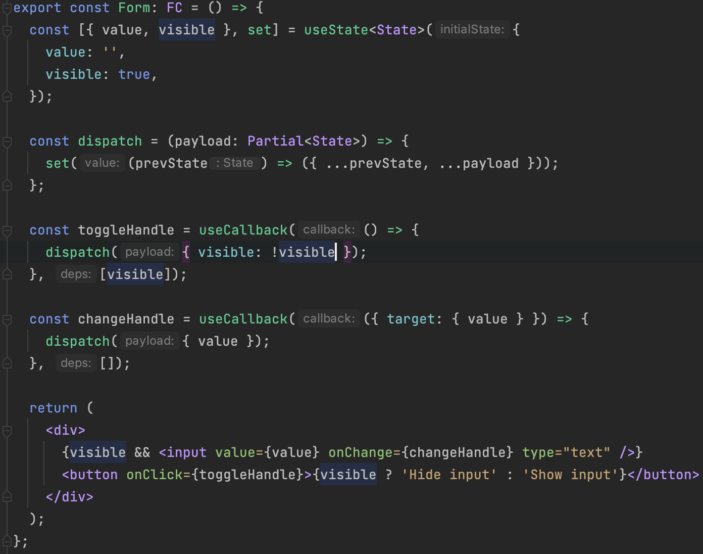
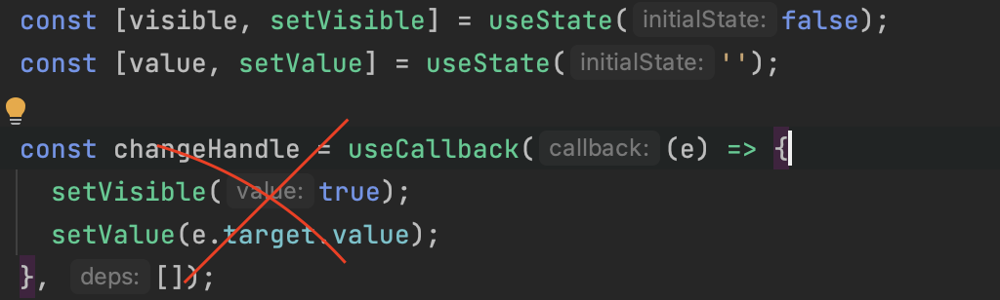

# Состояние

Для реализации состояний нужно применять хуки из коробки React: `useState`, `useReducer`.

`useReducer` применяется в основном в случаях, когда необходимо:

1. Хранить большое кол-во данных в состоянии.
2. При использовании `React Context`.

Хук `useState` справляется с большинством задач. При хранении в useState объектов необходимо изменять состояние на основе предыдущего, это гарантирует стабильность и предсказуемость изменений. Для удобства можно создать функцию `dispatch`:



:::danger Внимание!
При использовании нескольких состояний необходимо избегать последовательное изменение их друг за другом, например:
:::


Подобное изменение состояние приведет к нескольким render-ам компонента, поэтому в таких случаях лучше создать один объект состояния и изменять его, например с использованием функции dispatch.

```jsx title="Приветствуется сокращение кода без фанатизма, например переключатель состояния показать/скрыть легко обыграть через useReducer"
const [visible, setToggle] = useReducer((p) => !p, false);

return <button onClick={toggle}>{visible ? "Hide" : "Show"}</button>;
```

```jsx title="При использовании useState код был бы немного больше"
const [visible, toggle] = useState(false);

const toggleHandler = useCallback(() => {
  toggle((prev) => !prev);
}, []);
```

Из минусов сокращения при useReducer можно отметить невозможность использования useCallback, его конечно можно добавить, но тогда сокращение будет минимальным. Поэтому всегда нужно смотреть по ситуации, что уместно, а что нет.

При использовании `useReducer` его экшен и редьюсер необходимо размещать в отдельных файлах, для этого на уровне файла компонента создаем директорию state со следующей структурой:

```plaintext
state
|___reducer
|   |___index.ts
|
|___actions
|   |___index.ts
|
|___index.ts
```

В корне state мы добавляем файл index.ts c экспортом констант, типов из reducer и actions.

При создании редьюсера необходимо добавить экспорт константный и дефолтный.

При создании экшенов добавляются только экспорты констант.

:::warning Внимание!
Для единичных компонентов использовать состояния на основе стейт менеджеров запрещено. Если нужен большой prop-drilling лучше организовать его через `React.Context`.
:::
